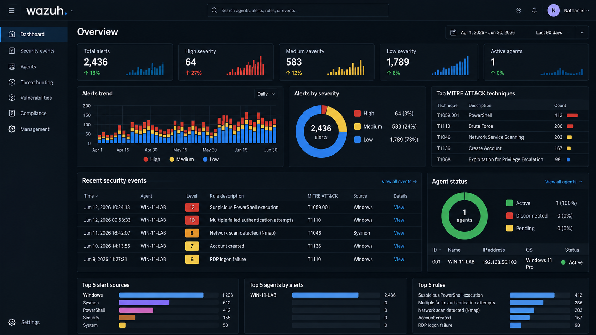

# Wazuh Configuration

## Overview

Wazuh serves as the central security monitoring platform for the laboratory.

The platform collects endpoint telemetry, analyzes security events, generates alerts, and provides an interface for investigation.

## Components

The Wazuh environment consists of:

- Wazuh Manager
- Wazuh Indexer
- Wazuh Dashboard
- Wazuh Agent

## Monitoring

The dashboard provides visibility into:

- Security alerts
- Event activity
- Agent status
- Alert severity
- MITRE ATT&CK techniques
- Endpoint activity

## Alert Investigation

Security alerts were investigated using information including:

- Alert timestamp
- Agent name
- Rule description
- Severity
- Event source
- User
- Process
- MITRE ATT&CK technique

## Alert Severity

Alerts are categorized by severity to help prioritize security events for investigation.

Higher-severity alerts receive greater attention during the investigation process.

## Dashboard

## Security Events

